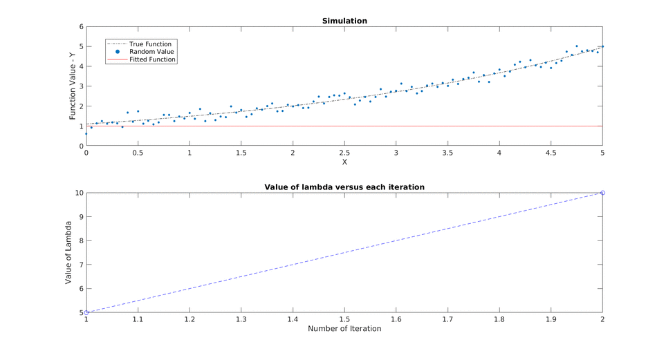

# Non-Linear_Least_Square_Optimization

Solving the non linear least square minimization problem using Improved Gauss-Newton methods like **line search** and **trust region**(Levenberg-Marquardt) for the 2-D pose graph problem.

Finding an optimal solution for a non linear function is difficult. It is hard to determine whether it has no solution, one solution or any number of solution. Then, solving it becomes additionally hard with no traditional methods to employ so some heuristics have to be employed. Here we implement a heuristic of LM by posing the problem as Non-Linear Least Squares to find an approximate solution to the problem.

fi(x) = 0 i = 1...m

fi(x) is called the ith residual

So, the non-linear least squares problem is posed as minimizing the sum of sqaures of the residual.

**Solving the non-linear least square**
The Gauss Newton algorithm is discussed in detail below for the case of **non-linear model fitting**. It is an iterative algorithm which keeps moving towards the optimal solution by finding the approximate answers on the way. LM is an extension of Gauss Newton algorithm which overcomes the drawbacks of vanilla Gauss Newton which fails to converge in most of the cases.

**Non-Linear Model Fitting**
We have random observations (yi) from any process for some conditions/ inputs (xi) and we want to fit a function (f(xi, theta))
where theta is the parameter we want to optimize for to find a fitted curve.

**Gauss Newton**
Let's dive into the derivation of Gauss Newton straight.

We want to find the optimal parameters (theta hat) for which we mini

For each iteration we want to solve for the change in theta defined as delta and want to see how close are we in solving the optimization which stops depending upong these three criteria:

1. 
2. 
3.

For a change in delta, the value of the funtion is approximated using taylor series
/
jacobian)

now lets put the linearization to zero to find delta

**LM**

Overcome the shortcomings by adding a lambda term

 
